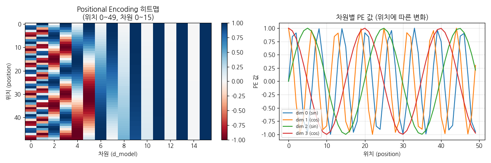
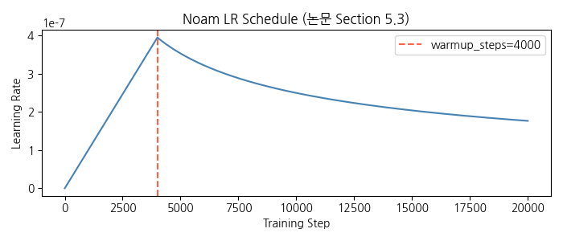

# Attention Is All You Need — PyTorch 구현 스터디 노트

> **Vaswani et al., "Attention Is All You Need", NeurIPS 2017**  
> arXiv: [1706.03762](https://arxiv.org/abs/1706.03762)  
> 논문의 전체 Transformer 아키텍처를 PyTorch로 구현한 스터디 노트  
> 각 연산마다 텐서의 shape 변화를 직접 출력해 수식과 코드의 대응 관계를 추적할 수 있음

---

## 목차

1. [프로젝트 개요](#1-프로젝트-개요)
   - 1.1 [파일 구성](#11-파일-구성)
   - 1.2 [아키텍처 개요](#12-아키텍처-개요)
   - 1.3 [실행 방법](#13-실행-방법)
2. [구현 컴포넌트](#2-구현-컴포넌트)
   - 2.1 [Scaled Dot-Product Attention](#21-scaled-dot-product-attention)
   - 2.2 [Multi-Head Attention](#22-multi-head-attention)
   - 2.3 [Position-wise FFN](#23-position-wise-feed-forward-network)
   - 2.4 [Positional Encoding & 임베딩](#24-positional-encoding--임베딩)
   - 2.5 [Encoder / Decoder Layer](#25-encoder--decoder-layer)
   - 2.6 [Mask 생성](#26-mask-생성)
   - 2.7 [Transformer 전체](#27-transformer-전체)
   - 2.8 [텐서 Shape 흐름 요약](#28-텐서-shape-흐름-요약)
3. [하이퍼파라미터 & 학습 설정](#3-하이퍼파라미터--학습-설정)
   - 3.1 [하이퍼파라미터 (논문 Table 1)](#31-하이퍼파라미터-논문-table-1)
   - 3.2 [Noam LR Schedule](#32-noam-learning-rate-schedule)
   - 3.3 [Label Smoothing](#33-label-smoothing)
   - 3.4 [Teacher Forcing](#34-teacher-forcing)
   - 3.5 [Gradient Clipping](#35-gradient-clipping)
4. [논문과의 차이점 및 설계 결정](#4-논문과의-차이점-및-설계-결정)
5. [참고 자료](#5-참고-자료)

---

## 1. 프로젝트 개요

### 1.1 파일 구성

```
.
├── transformer_study.ipynb   # 메인 스터디 노트북 (shape 추적 포함)
├── README.md
└── requirements.txt
```

셀을 순서대로 실행하면 모든 클래스와 함수가 정의되고 각 단계의 출력을 확인할 수 있다.

---

### 1.3 실행 방법

```bash
# 의존성 설치
pip install torch

# Jupyter에서 실행
jupyter notebook transformer_study.ipynb
```

노트북은 셀을 순서대로 실행하도록 설계되어 있다. 섹션 1의 하이퍼파라미터를 변경하면 이후 모든 셀의 shape 출력이 자동으로 반영된다.

**Study 값 → 논문 Base 값으로 교체:**
```python
D_MODEL    = 512   # 16 → 512
NUM_HEADS  = 8     # 2  → 8
NUM_LAYERS = 6     # 2  → 6
D_FF       = 2048  # 32 → 2048
DROPOUT    = 0.1   # 0.0 → 0.1
SRC_VOCAB  = 37000 # 100 → 37000
```

---

### 1.2 아키텍처 개요

논문 Figure 1의 Encoder-Decoder 구조를 그대로 따릅니다.

```
              ┌─────────────────────────────────┐
 src tokens   │            ENCODER              │
──────────►   │  Embedding + PositionalEncoding │
(B, S)        │                                 │
              │  ┌──────────────────────────┐   │
              │  │      EncoderLayer × N    │   │
              │  │  ┌────────────────────┐  │   │
              │  │  │ Multi-Head         │  │   │   enc_output
              │  │  │ Self-Attention     │  │   │──────────────►┐
              │  │  │ + Add & Norm       │  │   │               │
              │  │  ├────────────────────┤  │   │               │
              │  │  │ Feed-Forward       │  │   │               │
              │  │  │ Network            │  │   │               │
              │  │  │ + Add & Norm       │  │   │               │
              │  │  └────────────────────┘  │   │               │
              │  └──────────────────────────┘   │               │
              └─────────────────────────────────┘               │
                                                                 ▼
              ┌─────────────────────────────────┐    ┌──────────────────┐
 tgt tokens   │            DECODER              │    │   Cross-Attention │
──────────►   │  Embedding + PositionalEncoding │    │  K, V ← enc_output│
(B, T)        │                                 │    └──────────────────┘
              │  ┌──────────────────────────┐   │               │
              │  │      DecoderLayer × N    │◄──────────────────┘
              │  │  ┌────────────────────┐  │   │
              │  │  │ Masked Multi-Head  │  │   │
              │  │  │ Self-Attention     │  │   │
              │  │  │ + Add & Norm       │  │   │
              │  │  ├────────────────────┤  │   │
              │  │  │ Cross-Attention    │  │   │
              │  │  │ + Add & Norm       │  │   │
              │  │  ├────────────────────┤  │   │
              │  │  │ Feed-Forward       │  │   │
              │  │  │ Network            │  │   │
              │  │  │ + Add & Norm       │  │   │
              │  │  └────────────────────┘  │   │
              │  └──────────────────────────┘   │
              └─────────────────────────────────┘
                              │
                              ▼ Linear + (Softmax at inference)
                         logits (B, T, V)
```

---

## 2. 구현 컴포넌트

### 2.1 Scaled Dot-Product Attention

**논문 §3.2.1, Equation (1)**

$$\text{Attention}(Q, K, V) = \text{softmax}\!\left(\frac{QK^\top}{\sqrt{d_k}}\right)V$$

```python
scores = torch.matmul(Q, K.transpose(-2, -1)) / math.sqrt(d_k)
if mask is not None:
    scores = scores.masked_fill(mask, -1e9)
attn_weights = F.softmax(scores, dim=-1)
output = torch.matmul(attn_weights, V)
```

**스케일링의 이유.**  
$Q$와 $K$의 원소가 $\mathcal{N}(0,1)$이면 내적의 분산은 $d_k$가 된다. $\sqrt{d_k}$로 나누면 분산을 1로 정규화하여 softmax가 extremely peaked되는 것을 방지하고 gradient vanishing 문제를 완화한다. 논문 저자들은 이 현상을 "the dot products grow large in magnitude, pushing the softmax function into regions where it has extremely small gradients"라고 설명한다.

**마스킹 구현.**  
`masked_fill(mask, -1e9)`는 mask=`True`인 위치에 $-10^9$를 주입한다. Softmax 이후 이 위치의 가중치는 $e^{-10^9} \approx 0$이 되어 해당 위치에 대한 어텐션이 차단된다. `-inf`를 사용하지 않는 이유는 수치 불안정(NaN) 가능성 때문이다.

**shape 흐름:**
```
Q: (B, h, S_q, d_k)
K: (B, h, S_k, d_k)  →  K^T: (B, h, d_k, S_k)
scores = QK^T / sqrt(d_k): (B, h, S_q, S_k)
attn_weights: (B, h, S_q, S_k)
output = attn_weights @ V: (B, h, S_q, d_v)
```

---

### 2.2 Multi-Head Attention

**논문 §3.2.2, Equation (4)(5)**

$$\text{MultiHead}(Q,K,V) = \text{Concat}(\text{head}_1, \ldots, \text{head}_h)\,W^O$$
$$\text{head}_i = \text{Attention}(QW_i^Q,\; KW_i^K,\; VW_i^V)$$

파라미터: $W_i^Q \in \mathbb{R}^{d_{\text{model}} \times d_k}$, $W_i^K \in \mathbb{R}^{d_{\text{model}} \times d_k}$, $W_i^V \in \mathbb{R}^{d_{\text{model}} \times d_v}$, $W^O \in \mathbb{R}^{hd_v \times d_{\text{model}}}$

**구현 핵심: `split_heads`의 텐서 변환**

```python
# (B, S, d_model) → (B, h, S, d_k)
x = x.view(B, S, self.num_heads, self.d_k)  # (B, S, h, d_k)
x = x.transpose(1, 2)                        # (B, h, S, d_k)
```

`view`와 `transpose`를 분리하는 이유: `view`는 contiguous 텐서에서만 동작하는 반면 `transpose`는 메모리 레이아웃을 바꾸지 않고 stride만 변경한다. 이후 `contiguous().view()`로 헤드를 재결합한다.

```python
# 헤드 결합: (B, h, S, d_k) → (B, S, d_model)
attn_out = attn_out.transpose(1, 2).contiguous().view(B, -1, self.d_model)
```

`contiguous()`가 필요한 이유: `transpose` 후에는 메모리가 연속적이지 않아 `view`를 바로 호출하면 `RuntimeError`가 발생한다. `contiguous()`는 데이터를 row-major 순서로 재배치하여 `view` 호출을 가능하게 한다.

**단일 헤드 vs. 멀티 헤드의 표현력 차이.**  
단일 어텐션 헤드는 하나의 표현 부분공간(representation subspace)만 학습한다. $h$개의 헤드를 병렬로 운영하면 각 헤드가 서로 다른 유형의 의존 관계(예: 문법적 관계, 의미적 관계, 위치적 관계)를 포착할 수 있다.

**전체 shape 흐름:**
```
입력 Q, K, V: (B, S, d_model)
   ↓ W_q/k/v Linear
(B, S, d_model)
   ↓ split_heads: view + transpose
(B, h, S, d_k)
   ↓ scaled_dot_product_attention
(B, h, S, d_k)  + weights (B, h, S_q, S_k)
   ↓ transpose(1,2) + contiguous() + view
(B, S, d_model)
   ↓ W_o Linear
(B, S, d_model)
```

---

### 2.3 Position-wise Feed-Forward Network

**논문 §3.3, Equation (2)**

$$\text{FFN}(x) = \max(0,\; xW_1 + b_1)\,W_2 + b_2$$

```python
self.net = nn.Sequential(
    nn.Linear(d_model, d_ff),   # W_1: d_model → d_ff (=2048)
    nn.ReLU(),
    nn.Dropout(dropout),
    nn.Linear(d_ff, d_model),   # W_2: d_ff → d_model
)
```

"Position-wise"의 의미는 시퀀스의 각 위치(토큰)에 **독립적으로** 동일한 FFN을 적용한다는 것이다. 위치 간 파라미터는 공유되지만 위치 간 상호작용은 없다 — 위치 간 상호작용은 오직 Attention에서만 발생한다. $d_{\text{ff}} = 4 \times d_{\text{model}}$으로 설정하는 것이 관례이며, 이는 key-value memory 관점에서 해석할 수도 있다 (Geva et al., 2021).

**shape 흐름:**
```
(B, S, d_model) → Linear → (B, S, d_ff) → ReLU → Linear → (B, S, d_model)
```

---

### 2.4 Positional Encoding & 임베딩

**논문 §3.5, Equation (3)(4)**

$$PE_{(pos,\, 2i)} = \sin\!\left(\frac{pos}{10000^{2i/d_{\text{model}}}}\right), \quad
PE_{(pos,\, 2i+1)} = \cos\!\left(\frac{pos}{10000^{2i/d_{\text{model}}}}\right)$$

```python
pe = torch.zeros(max_len, d_model)
position = torch.arange(0, max_len).unsqueeze(1).float()          # (max_len, 1)
div_term = torch.exp(
    torch.arange(0, d_model, 2).float() * (-math.log(10000.0) / d_model)
)                                                                   # (d_model/2,)
pe[:, 0::2] = torch.sin(position * div_term)
pe[:, 1::2] = torch.cos(position * div_term)
self.register_buffer('pe', pe.unsqueeze(0))                        # (1, max_len, d_model)
```



**log-space 계산의 이유.**  
$10000^{2i/d_{\text{model}}}$을 직접 계산하면 $i$가 커질수록 오버플로우 위험이 있다. 로그 공간에서 `exp(log(10000) * 2i/d_model)`의 역수 형태로 div_term을 계산하면 수치적으로 안정하다.

**사인/코사인을 사용하는 이유.**  
임의의 오프셋 $k$에 대해 $PE_{pos+k}$가 $PE_{pos}$의 선형 함수로 표현된다 — 즉, 모델이 상대적 위치를 표현하는 데 유리하다. 논문 저자들은 학습된 positional embedding과의 성능 차이가 거의 없음을 확인하고, 훈련보다 긴 시퀀스에도 대응 가능한 고정 인코딩을 선택했다.

**`register_buffer`의 역할.**  
`register_buffer`로 등록된 텐서는 `model.parameters()`에 포함되지 않아 optimizer가 업데이트하지 않는다. 그러나 `state_dict`에는 포함되어 저장/로드 시 유지되고, `model.to(device)` 호출 시 파라미터와 함께 자동으로 디바이스를 이동한다.

**임베딩 스케일링 (§3.4).**  
임베딩에 $\sqrt{d_{\text{model}}}$을 곱하는 이유는 Xavier 초기화로 생성된 임베딩 벡터의 크기가 작아 PE 신호에 의해 묻히는 것을 방지하기 위함이다.

---

### 2.5 Encoder / Decoder Layer

**Encoder Layer (논문 §3.1)**

각 서브레이어에 Residual Connection + Layer Normalization을 적용한다:

$$\text{출력} = \text{LayerNorm}(x + \text{Sublayer}(x))$$

```
서브레이어 1: Multi-Head Self-Attention  (Q=K=V=x)
서브레이어 2: Position-wise FFN
```

**Decoder Layer (논문 §3.1)**

```
서브레이어 1: Masked Multi-Head Self-Attention  (Q=K=V=x, tgt_mask 적용)
서브레이어 2: Cross-Attention                   (Q=x, K=V=enc_output, src_mask 적용)
서브레이어 3: Position-wise FFN
```

**LayerNorm vs. BatchNorm.**  
BatchNorm은 배치 내 다른 샘플들의 통계를 사용하므로 배치 크기에 민감하고, 가변 길이 시퀀스에서 적용이 어렵다. LayerNorm은 각 샘플의 마지막 차원($d_{\text{model}}$)에 대해 독립적으로 정규화하므로 배치 크기에 무관하고 NLP 태스크에 적합하다.

**Pre-Norm vs. Post-Norm.**  
본 구현은 논문 원본의 Post-Norm 방식(`LayerNorm(x + Sublayer(x))`)을 따른다. 이후 연구들(예: GPT-2, PaLM)은 학습 안정성을 위해 Pre-Norm(`x + Sublayer(LayerNorm(x))`)을 선호하는 경향이 있다.

**Residual Connection의 역할.**  
깊은 네트워크에서 gradient가 역전파될 때 각 레이어를 통해 직접 흐를 수 있는 경로를 제공한다. 논문에서는 6개 레이어를 쌓으면서도 안정적인 학습이 가능하도록 Residual + LayerNorm 조합을 사용한다.

---

### 2.6 Mask 생성

**Padding Mask**

```python
mask = (seq == pad_idx).unsqueeze(1).unsqueeze(2)
# (B, S) → (B, 1, 1, S)
# MHA 내부에서 (B, h, S_q, S_k)로 브로드캐스팅
```

`<PAD>` 토큰은 의미 없는 패딩이므로 어텐션에서 완전히 배제한다.

**Causal (Look-ahead) Mask**

```python
mask = torch.triu(torch.ones(seq_len, seq_len), diagonal=1).bool()
# (seq_len, seq_len) → (1, 1, seq_len, seq_len)
```

`torch.triu(..., diagonal=1)`은 대각선 위의 상삼각 행렬을 생성한다. 위치 $i$에서 $j > i$인 모든 위치(미래)를 차단하여 Decoder가 자동회귀적으로 토큰을 생성하도록 강제한다.

```
seq_len=4 Causal Mask (True=차단):
pos  0  1  2  3
 0 [ □  ■  ■  ■ ]   pos 0은 자기 자신만 참조
 1 [ □  □  ■  ■ ]   pos 1은 0~1 참조
 2 [ □  □  □  ■ ]   pos 2는 0~2 참조
 3 [ □  □  □  □ ]   pos 3은 0~3 모두 참조
```

**Decoder의 최종 tgt_mask.**  
Padding Mask와 Causal Mask를 element-wise OR로 결합한다:

```python
tgt_mask = tgt_pad_mask | tgt_causal_mask
# (B, 1, 1, T) | (1, 1, T, T) → (B, 1, T, T)  브로드캐스팅
```

---

### 2.7 Transformer 전체

```python
class Transformer(nn.Module):
    def forward(self, src, tgt):
        # 마스크 생성
        src_mask = make_padding_mask(src, self.pad_idx)
        tgt_mask = make_padding_mask(tgt, self.pad_idx) | make_causal_mask(tgt.size(1))

        enc_output = self.encoder(src, src_mask)              # (B, S, d_model)
        dec_output = self.decoder(tgt, enc_output,
                                   src_mask, tgt_mask)        # (B, T, d_model)
        logits = self.output_proj(dec_output)                  # (B, T, V)
        return logits
```

**파라미터 초기화 (§5.4).**  
Xavier Uniform 초기화를 사용한다:

```python
nn.init.xavier_uniform_(p)
# Var(W) = 2 / (fan_in + fan_out)
```

Xavier 초기화는 순전파에서 각 레이어의 출력 분산이 입력 분산과 같게 유지되고, 역전파에서 gradient의 분산도 일정하게 유지되도록 설계된다. 1D bias 텐서는 초기화에서 제외한다(`p.dim() > 1` 조건).

---

## 3. 하이퍼파라미터 & 학습 설정

### 3.1 하이퍼파라미터 (논문 Table 1)

노트북 상단에서 Study 값(작은 숫자)과 논문 원본 값을 나란히 비교할 수 있도록 구성했다.

| 파라미터 | 코드 변수 | Study 값 | 논문 Base | 논문 Big | 관련 섹션 |
|----------|-----------|----------|-----------|----------|-----------|
| 모델 차원 | `D_MODEL` | 16 | 512 | 1024 | §3.1 |
| 어텐션 헤드 수 | `NUM_HEADS` | 2 | 8 | 16 | §3.2.2 |
| 헤드 당 차원 | `D_K` = D_MODEL/h | 8 | 64 | 64 | Eq.(4) |
| 레이어 수 | `NUM_LAYERS` | 2 | 6 | 6 | §3.1 |
| FFN 차원 | `D_FF` | 32 | 2048 | 4096 | §3.3, Eq.(2) |
| 드롭아웃 | `DROPOUT` | 0.0 | 0.1 | 0.3 | §5.4 |
| 소스 어휘 크기 | `SRC_VOCAB` | 100 | ~37,000 | ~37,000 | §6 |
| Warmup 스텝 | `WARMUP_STEPS` | 4000 | 4000 | 4000 | §5.3, Eq.(3) |
| Adam β₁ | `BETA1` | 0.9 | 0.9 | 0.9 | §5.3 |
| Adam β₂ | `BETA2` | 0.98 | 0.98 | 0.98 | §5.3 |
| Adam ε | `EPS` | 1e-9 | 1e-9 | 1e-9 | §5.3 |
| Label Smoothing | `LABEL_SMOOTH` | 0.1 | 0.1 | 0.1 | §5.4 |

> Study 값(`DROPOUT=0.0`)은 shape 추적 목적이므로 실제 학습 시에는 논문 값(`0.1`)으로 변경해야 한다.

---

### 3.2 Noam Learning Rate Schedule (§5.3)

$$lrate = d_{\text{model}}^{-0.5} \cdot \min\!\left(step^{-0.5},\; step \cdot warmup\_steps^{-1.5}\right)$$

- `step < warmup_steps`: learning rate가 선형 증가 → 초기 학습 안정화
- `step > warmup_steps`: $step^{-0.5}$에 비례해 감소 → 수렴 시 세밀한 업데이트

```python
def noam_lr(step, d_model, warmup_steps=4000):
    step = max(step, 1)
    return d_model**(-0.5) * min(step**(-0.5), step * warmup_steps**(-1.5))

scheduler = torch.optim.lr_scheduler.LambdaLR(
    optimizer, lr_lambda=lambda step: noam_lr(step, D_MODEL)
)
```



### 3.3 Label Smoothing (§5.4)

정답 레이블에 $1 - \epsilon_{ls}$ ($= 0.9$)의 확률을 부여하고 나머지 어휘에 $\epsilon_{ls} / (V-1)$의 확률을 분산시킨다. 모델이 과도하게 confident해지는 것을 방지하고 BLEU 성능을 개선한다. PyTorch에서는 `nn.CrossEntropyLoss(label_smoothing=0.1)`로 직접 지원된다.

### 3.4 Teacher Forcing

학습 시 Decoder 입력으로 이전 타임스텝의 **예측값** 대신 **실제 정답 토큰**을 사용한다. 이를 통해 에러가 누적되는 exposure bias 없이 안정적인 학습이 가능하다.

```python
tgt_input = tgt[:, :-1]   # <BOS> t_1 t_2 ... t_{T-1}
tgt_label = tgt[:, 1:]    # t_1  t_2 ... t_{T-1} <EOS>
logits = model(src, tgt_input)
loss = criterion(logits.view(-1, VOCAB), tgt_label.reshape(-1))
```

### 3.5 Gradient Clipping

```python
torch.nn.utils.clip_grad_norm_(model.parameters(), max_norm=1.0)
```

gradient의 L2 norm이 `max_norm`을 초과하면 전체 gradient를 균일하게 스케일 다운하여 gradient exploding을 방지한다.

### 2.8 텐서 Shape 흐름 요약

논문 Base Model 기준 (`B=2, S=10, T=8, d_model=512, h=8, d_k=64, N=6`):

```
[ENCODER]
src tokens     (B, S)           = (2, 10)
  ↓ Embedding × √d_model
embedded       (B, S, d_model)  = (2, 10, 512)
  ↓ PositionalEncoding
x              (B, S, d_model)  = (2, 10, 512)
  ↓ EncoderLayer × 6
    ├─ Self-Attn
    │   Q=K=V:   (B, S, d_model) = (2, 10, 512)
    │   split → (B, h, S, d_k)  = (2, 8, 10, 64)
    │   scores:  (B, h, S, S)   = (2, 8, 10, 10)
    │   output:  (B, h, S, d_k) = (2, 8, 10, 64)
    │   concat → (B, S, d_model) = (2, 10, 512)
    └─ FFN
        hidden:  (B, S, d_ff)   = (2, 10, 2048)
        output:  (B, S, d_model) = (2, 10, 512)
enc_output     (B, S, d_model)  = (2, 10, 512)

[DECODER]
tgt tokens     (B, T)           = (2, 8)
  ↓ Embedding + PE
x              (B, T, d_model)  = (2, 8, 512)
  ↓ DecoderLayer × 6
    ├─ Masked Self-Attn: (2, 8, 512) (tgt_mask 적용)
    ├─ Cross-Attn
    │   Q:   (B, h, T, d_k)    = (2, 8, 8, 64)
    │   K,V: (B, h, S, d_k)    = (2, 8, 10, 64)
    │   scores: (B, h, T, S)   = (2, 8, 8, 10)
    │   output: (B, T, d_model) = (2, 8, 512)
    └─ FFN: (2, 8, 512)
dec_output     (B, T, d_model)  = (2, 8, 512)
  ↓ Linear (output_proj)
logits         (B, T, V)        = (2, 8, 10000)
```

---

## 4. 논문과의 차이점 및 설계 결정

| 항목 | 논문 원본 | 본 구현 | 이유 |
|------|-----------|---------|------|
| Norm 위치 | Post-Norm | Post-Norm | 논문 원본 충실 재현 |
| Embedding weight tying | Encoder·Decoder·출력 임베딩 공유 | 별도 `nn.Linear` | 코드 명확성 우선 |
| 토크나이저 | BPE (byte-pair encoding) | 정수 인덱스 더미 데이터 | 구조 이해에 집중 |
| 학습 데이터 | WMT EN-DE (4.5M 문장) | 랜덤 더미 텐서 | shape 추적 목적 |
| 추론 | Beam Search (beam=4, α=0.6) | Greedy (미구현) | 스터디 범위 외 |
| Dropout 위치 | 각 서브레이어 출력 + 임베딩 후 | 동일 | — |

**Embedding weight tying이란?**  
논문 §3.4에서 Encoder 임베딩, Decoder 임베딩, 출력 직전 Linear의 가중치 행렬을 공유한다고 명시한다 (Press & Wolf, 2017). 동일한 어휘 공간에서의 임베딩과 역임베딩이 일관성을 가져야 한다는 직관에 근거하며, 파라미터 수를 줄이는 효과도 있다.

---

## 5. 참고 자료

**원본 논문**
- Vaswani et al., [Attention Is All You Need](https://arxiv.org/abs/1706.03762), NeurIPS 2017

**구현 참고**
- [The Annotated Transformer](https://nlp.seas.harvard.edu/2018/04/03/attention.html) — Harvard NLP, Rush et al.
- [PyTorch 공식 문서](https://pytorch.org/docs/stable/)
